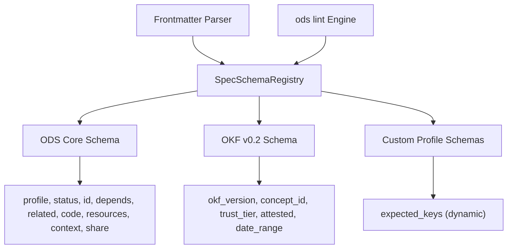

# Implementation Plan: Schema-Driven Spec Key Management Engine

This document outlines the technical plan to upgrade **`ods-core`** to use a **Schema-Driven Spec Key Registry**. This architecture decouples frontmatter key validation, parsing rules, and spec metadata (ODS, Google OKF, Custom Profiles, and Custom Domain Keys) into declarative, reusable schema definitions.

---

## 1. Motivation & Objectives

### Current Limitation
- Frontmatter keys (e.g. `profile`, `status`, `okf_version`, `expected_keys`, `packs`, `aliases`) are checked via hardcoded `match` arms or spread across `parse/frontmatter.rs`, `lint/checker.rs`, and `spec.rs`.
- Adding or updating keys for a specification requires editing multiple hardcoded parser branches.

### Schema-Driven Vision
- **Declarative Spec Schemas**: Define `SpecSchema` structs for ODS, OKF, and Custom Profiles.
- **Dynamic Custom Key Resolution**: Register required/expected keys dynamically from custom profile definitions (`expected_keys:`).
- **Unified Validation Pipeline**: `ods lint` passes frontmatter through `SpecSchemaRegistry::validate()`, providing precise, spec-aware diagnostic reporting.
- **Top-Level vs Nested Scoping**: Automatically enforce key scoping rules (e.g., custom domain keys `author`/`reviewer` at top-level; ODS engine keys `profile`/`status` inside nested `ods:` block).

---

## 2. Architecture & Data Model



### Data Structures (`src/ods-core/src/spec/`)

```rust
pub enum SpecKind {
    Ods,
    Okf,
    Custom(String),
}

pub enum KeyPlacement {
    TopLevel,        // e.g. title, author, reviewer, endpoint_url
    NestedEngineMap, // e.g. ods.profile, ods.status, ods.id
    RootIndexOnly,   // e.g. custom-profiles, packs, ignore
}

pub enum KeyType {
    String,
    List,
    Map,
    Enum(Vec<String>),
    Timestamp,
}

pub struct KeyDefinition {
    pub name: String,
    pub placement: KeyPlacement,
    pub key_type: KeyType,
    pub required: bool,
    pub description: String,
}

pub struct SpecSchema {
    pub kind: SpecKind,
    pub version: String,
    pub keys: Vec<KeyDefinition>,
}
```

---

## 3. Proposed Component Changes

### Component: `ods-core/src/spec/`

#### [NEW] [schema.rs](file:///home/beingminimal/Downloads/gh-beingminimal/open-doc-spec/ods/src/ods-core/src/spec/schema.rs)
- Implements `SpecSchema`, `KeyDefinition`, `KeyPlacement`, `KeyType`, and `SpecSchemaRegistry`.
- Pre-loads standard schemas:
  - `ods_schema()`: Standard ODS keys + key placement constraints.
  - `okf_schema()`: Standard OKF v0.2 keys.

#### [MODIFY] [descriptor.rs](file:///home/beingminimal/Downloads/gh-beingminimal/open-doc-spec/ods/src/ods-core/src/spec/descriptor.rs)
- Integrates `SpecSchemaRegistry` with existing `SpecDescriptor` and `ExtractedKeys`.

---

### Component: `ods-core/src/parse/`

#### [MODIFY] [frontmatter.rs](file:///home/beingminimal/Downloads/gh-beingminimal/open-doc-spec/ods/src/ods-core/src/parse/frontmatter.rs)
- Uses `SpecSchemaRegistry` to dispatch scalar vs list vs map key parsing dynamically.

---

### Component: `ods-core/src/lint/`

#### [MODIFY] [checker.rs](file:///home/beingminimal/Downloads/gh-beingminimal/open-doc-spec/ods/src/ods-core/src/lint/checker.rs)
- Validates target document frontmatter against active profile's `SpecSchema`:
  - Verifies presence of keys declared under `expected_keys:`.
  - Emits warnings if engine keys (`profile`, `status`) are misplaced outside `ods:` map.

---

## 4. Work Plan & Task Breakdown

### Phase 1: Spec Schema Model & Registry
- [ ] Create `src/ods-core/src/spec/schema.rs` with `SpecSchema`, `KeyDefinition`, and `SpecSchemaRegistry`.
- [ ] Define standard ODS, OKF, and Custom Profile schemas in `schema.rs`.
- [ ] Export `schema.rs` modules in `src/ods-core/src/spec/mod.rs` and `lib.rs`.

### Phase 2: Schema-Driven Frontmatter Parser Integration
- [ ] Refactor `parse_frontmatter_text` in `parse/frontmatter.rs` to validate frontmatter key types via `SpecSchemaRegistry`.
- [ ] Ensure unknown/custom domain keys (`author`, `reviewer`, `endpoint_url`) pass through cleanly into custom attributes.

### Phase 3: Schema-Driven Linter & Key Placement Checker
- [ ] Update `lint_document_in_workspace` in `lint/checker.rs` to validate `expected_keys` using the `SpecSchema` generated for custom profiles.
- [ ] Enforce placement checks (`ods.profile`, `ods.status` inside `ods:`).

### Phase 4: Tests & Verification
- [ ] Add unit tests in `src/ods-core/src/spec/schema.rs` testing registry lookups.
- [ ] Add integration test `schema_spec_lint_test.rs` verifying lint error detection for missing `expected_keys` and misplaced engine keys.
- [ ] Run `cargo test --workspace` to ensure 100% test suite pass.

---

## 5. Verification Plan

### Automated Tests
- Run `cargo test --workspace`
- Verify new unit tests in `ods-core::spec::schema::tests`

### Manual Verification Scenario
1. Create custom profile `docs/profiles/api_endpoint.md`:
   ```yaml
   ---
   name: api_endpoint
   expected_keys:
     - endpoint_url
   ods:
     profile: custom-profile
     status: stable
   ---
   ```
2. Create test document `docs/apis/user.md` without `endpoint_url`.
3. Run `cargo run --bin ods -- lint docs/apis/user.md` $\rightarrow$ Verifies diagnostic error for missing `endpoint_url`.
